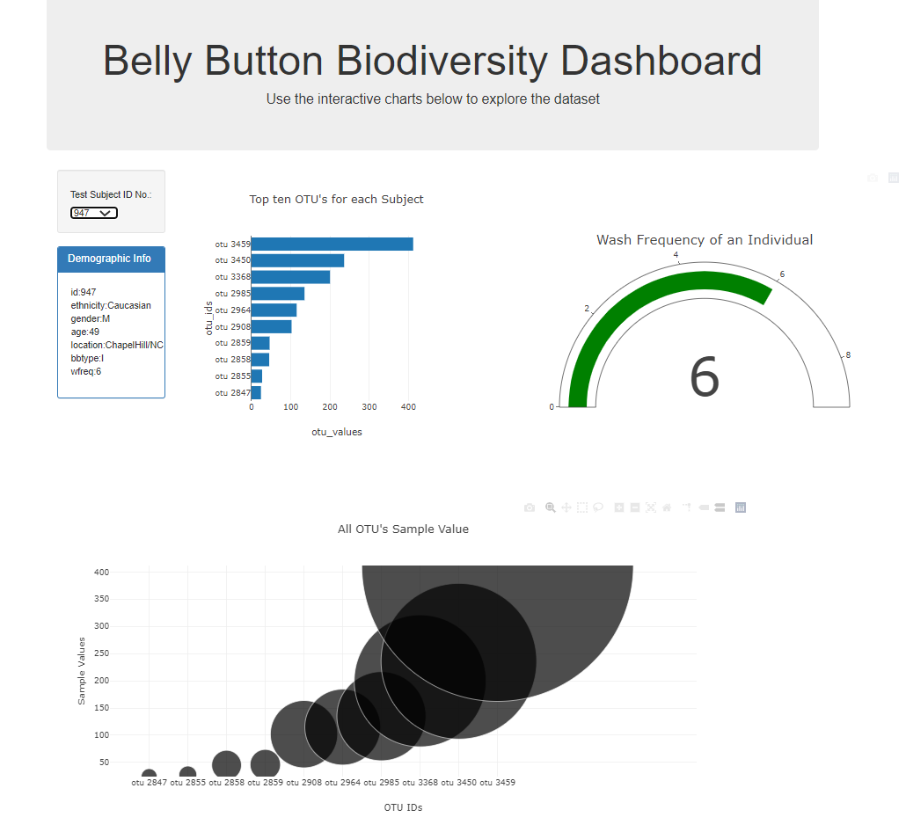

# Interactive Visualizations and Dashboards

# Table of contents:
*	General Info
*	Technologies
*	Features
*	Setup
*	Code examples
*	Status
*	Contact

# General info:
*	Plotly Python graphing library helps in displaying the data in the form of graphs which makes it look intresting and helps in understand the data very well. 
*	Plotly is interactive and supports chart types covering a wide range of statistical, financial, geographic, scientific, and 3-dimensional use-cases.

# Technologies:
*	We used visual studio code.

# Features:
*	D3, DOM manipulations, slice, sort, functions were used to show the data in Belly Button Biodiversity dashboard.
*	The data charts are displayed based on test sbject ID no from the drop down menu.
*	Based on the user input, corresponding Demographis Info, bar chart representing the top 10 OTU's of selected subject, bubble chart representing all the OTU sample values and gauge chart representing the wash frequency of selected subject Id are displayed in the web page. 

# Setup:
*	There was no specific setup done to work with Interactive Visualisations and Dashboards.
*	Visual studio code was used to write the index.html, app.js.

# Code Examples:
* Enter subject Id number as input in 'Test subject ID No' field ( eg: 947).

* All the data corresponding to selected subject ID will be dispalyed in:
    * Demoraphics info which covers id, ethinicity, gender, age, location, bbtype, wfreq for each subject.
    * Bar chart representing the top 10 otu's for each subject in desending order. 
    * Bubble chart representing sample values of each selected subject. 
    * Gauge Chart representing the wash frequency of an individual.  

## Show examples of usage:
On selecting the subject ID number from the dropdown menu, corresponding Demographics Information, Bar graph, Bunbble charts are displayed.

 * Upon selecting the 'Test Subject ID No', corresponding data is displayed in the form of charts. 
 

 # Status
Project is finished

# Contact
D. Sai Prasanna
 

